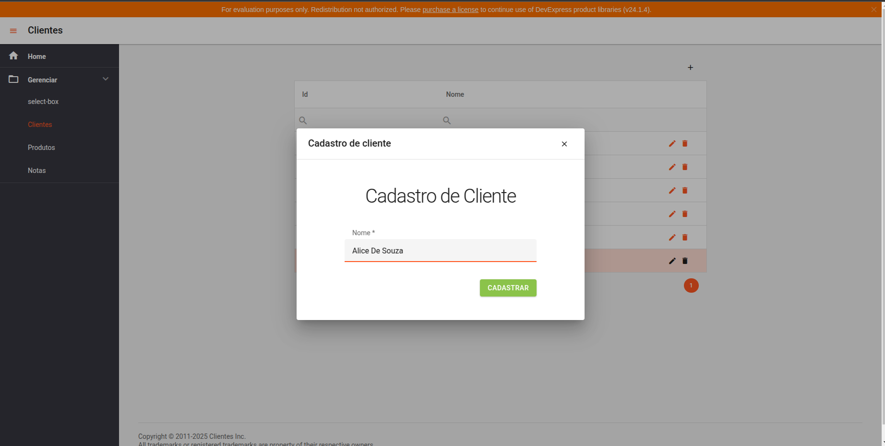
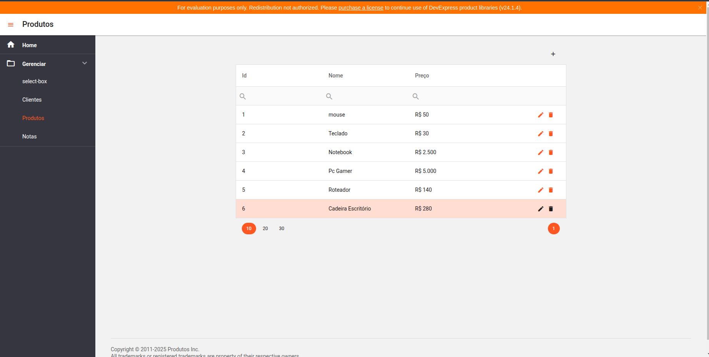
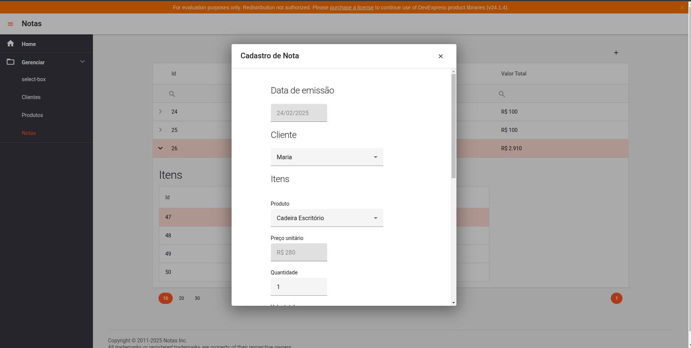

<h1 align="center" style="font-weight: bold;">Nota Fiscal 💻</h1>

<p>Autor: Inácio Souza Rocha</p>

[](https://www.linkedin.com/in/inacio-souza/)


<h2>Sobre o projeto</h2>
Este projeto é uma abstração de um sistema de emissão e gerenciamento de Notas Fiscais, sem fins comerciais ou uso real. Ele conta com três principais entidades: 

- Produto 
- Cliente
- Nota

Sobre estas entidades são realizadas operações de CRUD (criação, leitura, atualização e exclusão de dados).

## Tecnologias
1. `Back-end`:
    + Java 1.8
    + Spring Boot 2.7.15
    + Maven
    + PostgreSQL
  
2. `Front-end`:
     + Angular 16
     +  DevExtreme

<h2 id="started">🚀 Como rodar</h2>

  ### Pré-requisitos:
  Ter os progrmas abaixo previamente instalados e configurados na sua máquina.
  - `NodeJS`
  - `Angular`
  - `java`
  - `maven`
  - `postgres`
  - `git` 

  **OBS:** Opcionalmente você pode utilizar uma imagem Docker do Postgres para evitar o trabalho instalar o banco de dados

  ### Clonando o projeto

  <p>Abra o terminal em um diretório de sua preferência e cole:</p>
  
  ```bash
  git clone https://github.com/InacioSouza/Nota_Fiscal_Simplificada.git
  ```

### Executando servidor Spring
<p>Garanta que o banco de dados esteja criado e rodando. As configurações do banco devem estar de acordo com as propriedades do aplication.properties da aplicação spring <br><br> Na pasta back execute:</p>

```bash
mvn spring-boot:run
```

### Instalando as dependências Angular
  <p>Na pasta front do projeto execute</p>

  ```bash
  npm install
  ```
### Rodando aplicação Angular
<p>Ainda em front execute:</p>

```bash
  ng serve -o
  ```
<p>O navegador será aberto no endereço `http://localhost:4200/` </p>

A interface será renderizada na sua tela, você poderá navegar pelas páginas abaixo:

#### Página cadastro de clientes



#### Lista de produtos

**OBS:** <p>Nas páginas de listagem, só aparecerão dados se você os tiver cadastrado antes.</p>



### Emissão de nota Fiscal




